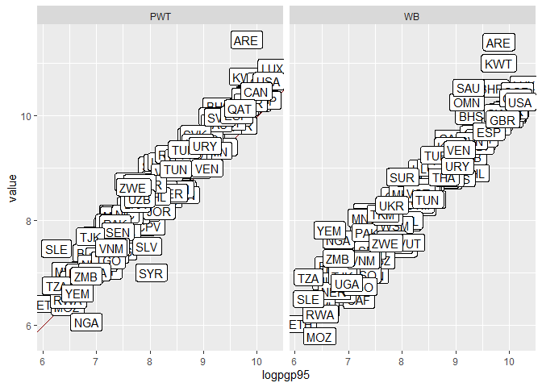
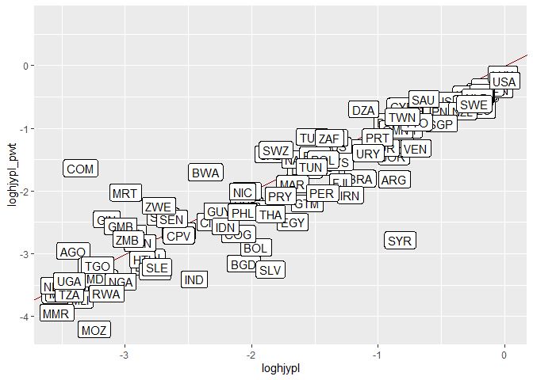
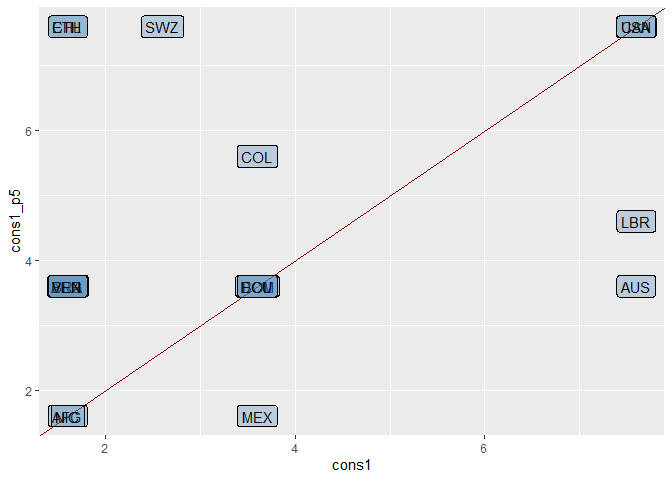
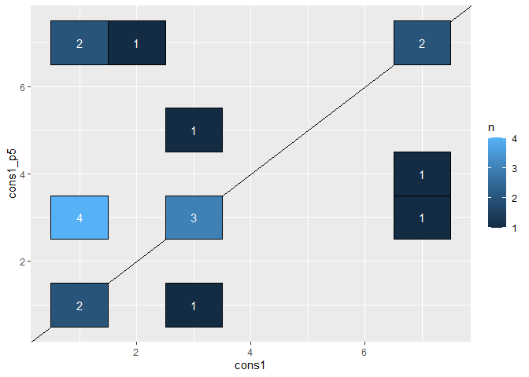
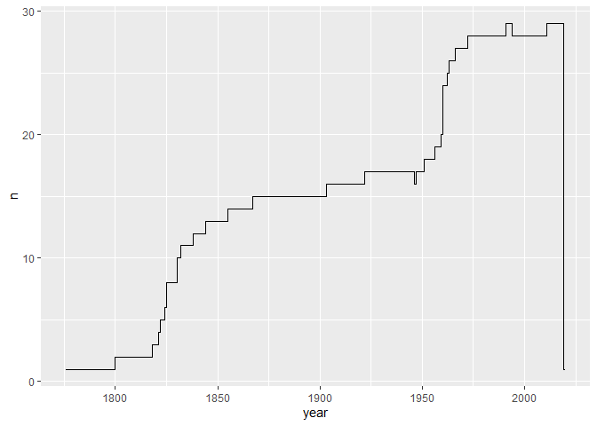

Acemoglu adatok keresése
================

``` r
library(tidyverse)
library(wbstats)
library(printr)

WD <- gsub(getwd(), pattern = "insution-colony.*", replacement = "insution-colony")
```

## Data from Acemoglu’s site

Összehasonlításként az összes csatolt adatot letöltöttem Acemoglu
honalapjáról, hogy ellenőrizni tudjuk az általunk gyűjtöttek
helyességét. Sajnos már az ide feltöltött adatok sem minden esetben
korrektek. Az adatfájlok mellé feltöltött .do fájlban az alábbi komment
olvasható például: “I am not sure what values of extmort4 were used to
calculate quantiles, perhaps from an earlier version of the data that I
do not have access to. Thus, I cannot exactly reproduce Table 1, but the
summary statistics that emerge using quantiles of extmort4 in the final
dataset are similar.”

`ace_data1` tartalmazza az Acemoglu oldalára Table 2 pont alatt
feltöltött DTA fájl adatait.

``` r
list.files(str_c(WD, "/Acemoglu-data"), full.names = TRUE) %>% 
  # read all data from authors website
  walk(~ assign(x = str_c("ace_data", str_remove_all(., "\\D")), # new name
                value = haven::read_dta(.), 
                envir = .GlobalEnv)
  )
```

A `basecp` vektor tartalmazza a felhasználni kívánt országok 3 betűs
jelölését.

``` r
baseco <- ace_data1 %>% 
  filter(!is.na(baseco)) %>% 
  pull(shortnam) %>% 
  as.character()
```

## Table1

Acemoglu oldaláról a táblázatok reprodukálást biztosító (/biztosístani
szándékozó) stata kódok elérhetőek.

<https://economics.mit.edu/faculty/acemoglu/data/ajr2001>

Átlagok:

``` r
ace_data1 %>% 
  select(-shortnam) %>% 
  {
    bind_rows(
    mutate(., n = ifelse(is.na(baseco), "base", "outer")) %>%
      group_by(n) %>%
      summarise_all(mean, na.rm = TRUE) %>%
      ungroup() %>%
      filter(n == "base"),
      summarise_all(., mean, na.rm = TRUE) %>% 
        mutate(n = "world")
    )
  } %>% 
  pivot_longer(-1) %>% 
  pivot_wider(names_from = n)
```

| name     |        base |      world |
|:---------|------------:|-----------:|
| euro1900 |  38.6174757 |  30.102410 |
| avexpr   |   7.4541958 |   6.988548 |
| logpgp95 |   8.4622103 |   8.304196 |
| cons1    |   4.0625000 |   3.630435 |
| democ00a |   0.1290323 |   1.122222 |
| cons00a  |   1.1944444 |   1.854167 |
| extmort4 | 148.9463330 | 214.964893 |
| logem4   |   4.4935445 |   4.611108 |
| loghjypl |  -1.5011873 |  -1.709099 |
| baseco   |         NaN |   1.000000 |

Kvantilisek:

``` r
ace_data1 %>% 
  filter(!is.na(baseco)) %>%
  mutate(g = cut(x = extmort4, breaks = quantile(extmort4, probs = (0:4)*.25), include.lowest = T, F)) %>%
  group_by(g) %>% 
  summarize_if(is.numeric, mean, na.rm = TRUE)
```

|   g |   euro1900 |   avexpr | logpgp95 |    cons1 | democ00a |  cons00a |  extmort4 |   logem4 |  loghjypl | baseco |
|----:|-----------:|---------:|---------:|---------:|---------:|---------:|----------:|---------:|----------:|-------:|
|   1 | 32.6562502 | 7.743316 | 8.873877 | 4.333333 | 4.133333 | 4.066667 |  31.92353 | 3.224033 | -1.075929 |      1 |
|   2 | 23.3333340 | 6.363636 | 8.327826 | 2.733333 | 2.285714 | 2.800000 |  73.31400 | 4.293698 | -1.496654 |      1 |
|   3 |  8.1705882 | 5.973262 | 7.777815 | 3.125000 | 0.187500 | 1.125000 | 139.75647 | 4.919492 | -2.195082 |      1 |
|   4 |  0.5333333 | 5.890909 | 7.199134 | 3.428571 | 0.000000 | 1.000000 | 781.33600 | 6.346973 | -3.025752 |      1 |

Ez alapján a változók mögötti értékek

``` r
NiceName <- function(x) {
  # code names and their meaning
  case_when(
    x == "logpgp95" ~ "Log GDP per capita (PPP) in 1995",
    x == "loghjypl" ~ "Log output pper worker in 1988",
    x == "avexpr" ~ "Average protection against expropriation risk",
    x == "cons1" ~ "Constrain on executive in 1900",
    x == "democ00a" ~ "Democracy in 1900",
    x == "euro1900" ~ "Eurpean settlements in 1900",
    x == "logem4" ~ "Log European settler mortaility",
    TRUE ~ x
  )
}
```

### GDP

Az összehasonlítás kivitelezéséhez minden változót azonos kóddal mentek,
mint Acemoglu, de utána írom a forrás rövidítését.

``` r
logpgp95_wb <- wb(indicator = "NY.GDP.PCAP.PP.CD") %>% 
  filter(date == 1995) %>% 
  transmute(geo = iso3c, logpgp95 = log(value))
```

``` r
pwt100 <- readxl::read_excel(str_c(WD, "/data/pwt100.xlsx"), sheet = "Data")
```

``` r
logpgp95_pwt <- pwt100 %>% 
  filter(year == 1995) %>% 
  transmute(geo = countrycode, logpgp95_pwt = log(rgdpe/pop))
  # rgde: Expenditure-side real GDP at chained PPPs (in mil. 2017US$)
```

``` r
logpgp95_checkdf <- list(
  logpgp95_wb %>%
  set_names("shortnam", "logpgp95_wb"),
  logpgp95_pwt %>% 
  set_names("shortnam", "logpgp95_pwt"),
  ace_data1
) %>% 
  reduce(full_join) %>% 
  select(shortnam, starts_with("logpgp95")) %>% 
  pivot_longer(-c(shortnam, logpgp95)) %>% 
  na.omit() %>% 
  mutate(
    name = str_remove_all(name, "logpgp95_"),
    name = str_to_upper(name)
    )
```

``` r
ggplot(logpgp95_checkdf) +
  aes(logpgp95, value, label = shortnam) + 
  facet_wrap(~ name) +
  geom_abline(color = "red4") +
  geom_label()
```

<!-- -->

``` r
logpgp95_checkdf %>% 
  group_by(name) %>% 
  summarise(
    pearson_cor = cor(value, logpgp95, method = "pearson"),
    spearman_cor = cor(value, logpgp95, method = "spearman"),
    rel_diff = mean(value - logpgp95 / logpgp95),
    n = n()
    )
```

| name | pearson_cor | spearman_cor | rel_diff |   n |
|:-----|------------:|-------------:|---------:|----:|
| PWT  |   0.9607875 |    0.9653931 | 7.734534 | 155 |
| WB   |   0.9519478 |    0.9603487 | 7.473285 | 156 |

A korrelációk és az eltérések alapján számomra nem teljesen egyértelmű,
hogy melyik forrás GDP adatát érdemesebb használni.

### Log output pper worker in 1988

``` r
loghjypl_pwt <- pwt100 %>% 
  filter(year == 1988) %>% 
  transmute(geo = countrycode, loghjypl_pwt = log(rgdpe/emp/1e5))
```

``` r
loghjypl_pwt %>% 
  right_join(ace_data1, by = c("geo" = "shortnam")) %>% 
  ggplot() +
  aes(loghjypl, loghjypl_pwt, label = geo) +
  geom_abline(color = "red4") + 
  geom_label()
```

<!-- -->

### Average protection against expropriation risk

### Constrain on executive in 1900

``` r
p5v2018 <- readxl::read_excel(str_c(WD, "/data/p5v2018.xls"))
```

``` r
cons1_p5 <- p5v2018 %>% 
  filter(year == 1900) %>% 
  select(geo = scode, cons1_p5 = xconst)
```

``` r
cons1_p5 %>% 
  left_join(ace_data1, by = c("geo" = "shortnam")) %>% 
  ggplot() +
  aes(cons1, cons1_p5, label = geo) +
  geom_abline(color = "red4") +
  geom_label(nudge_x = .6, nudge_y = .6, alpha = .3, fill = "steelblue")
```

<!-- -->

``` r
cons1_p5 %>% 
  left_join(ace_data1, by = c("geo" = "shortnam")) %>% 
  count(cons1_p5, cons1) %>% 
  na.omit() %>% 
  ggplot() +
  aes(cons1, cons1_p5, fill = n, label = n) +
  geom_abline() +
  geom_tile(color = "black") +
  geom_text(color = "white")
```

<!-- -->

Az ábrák alapján úgy néz ki, hogy el sem érhetőek az egyes országokra a
változók.

``` r
p5v2018 %>% 
  filter(scode %in% baseco) %>% 
  count(year) %>% 
  ggplot(aes(year, n)) +
  geom_step()
```

<!-- -->

1900-ban csak 15 országra érhető el adat a 64 elemezni kívántból.

democracy index: acemoglue honlap

temperature: ace

dummy landlocked: ace

Malaria: gallup cikkből kinézni

Latitude: r beépített

Yellow fever: ?
